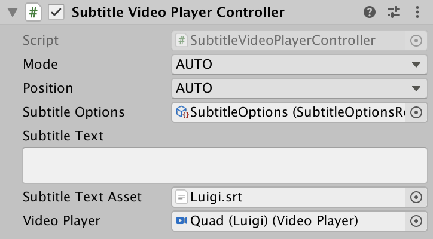

# Subtitles

Subtitles can be added to game objects with either `AudioSource` or `VideoPlayer` components. When these component begin playing, the subtitles will render the subtitles based on the timestamp.

## Audio Source


### Properties

| Property            | Description                                                                               |   Default |
| ------------------- | ----------------------------------------------------------------------------------------- | --------: |
| Default Mode        | Mode to render subtitle. Either `SCREEN`, `HEADSET`, or `OBJECT`                          | `HEADSET` |
| Default Position    | Position subtitles should render on screen. Either `TOP` or `BOTTOM`                      |  `BOTTOM` |
| Subtitle Options    | Reference to a subtitle options asset <sup><a href="#1">1</a></sup>                       |    `Null` |
| Subtitle Text       | Subtitle content - only SRT file format supported <sup><a href="#1">2</a></sup>           |      `""` |
| Subtitle Text Asset | Reference to subtitle file - only SRT file format supported <sup><a href="#1">2</a></sup> |    `Null` |
| Audio Source        | Reference to an `AudioSource` component.                                                  |    `Null` |

## Video Player



### Properties

| Property            | Description                                                                               |   Default |
| ------------------- | ----------------------------------------------------------------------------------------- | --------: |
| Default Mode        | Mode to render subtitle. Either `SCREEN`, `HEADSET`, or `OBJECT`                          | `HEADSET` |
| Default Position    | Position subtitles should render on screen. Either `TOP` or `BOTTOM`                      |  `BOTTOM` |
| Subtitle Options    | Reference to a subtitle options asset <sup><a href="#1">1</a></sup>                       |    `Null` |
| Subtitle Text       | Subtitle content - only SRT file format supported <sup><a href="#1">2</a></sup>           |      `""` |
| Subtitle Text Asset | Reference to subtitle file - only SRT file format supported <sup><a href="#1">2</a></sup> |    `Null` |
| Video Player        | Reference to an `VideoPlayer` component.                                                  |    `Null` |

## Options


### Properties

| Property                 | Description                                                          |                       Default |
| ------------------------ | -------------------------------------------------------------------- | ----------------------------: |
| Enabled                  | Toggle subtitles on or off.                                          |                         `Off` |
| Default Mode             | Mode to render subtitle. Either `SCREEN`, `HEADSET`, or `OBJECT`     |                     `HEADSET` |
| Default Position         | Position subtitles should render on screen. Either `TOP` or `BOTTOM` |                      `BOTTOM` |
| Billboard Towards Camera | Rotate subtitles rendered in `OBJECT` mode towards the main camera.  |                        `true` |
| Screen Padding           | Percentage of screen to be used as padding around subtitles.         |                          `10` |
| Object Padding           | World units to be used as padding around subtitles.                  |                        `0.25` |
| Font Size                | Subtitle font size.                                                  |                          `60` |
| Font Color               | Subtile font color                                                   |                       `White` |
| Font Asset               | TextMeshPro font to render subtitle with.                            |          `Roboto-Regular SDF` |
| Font Material            | TextMeshPro material to use with the TextMeshPro font.               | `Roboto-Regular SDF Material` |
| Text Alignment           | TextMeshPro text alignment property.                                 |                     `MidLine` |
| Show Background          | Toggle subtitle background on or off.                                |                          `On` |
| Background Color         | Background color that appears behind subtitle text                   |                       `Black` |
| Background Sprite        | Optional 9-splice sprite.                                            |                        `Null` |
| Background Padding       | Padding around the text inside the background.                       |                          `30` |

### Methods

#### Save

Save current state of the `SubtitleOptions` asset to file path.

```csharp
using A11YTK;
using UnityEngine;

public class SubtitleOptionManager : MonoBehaviour
{

    private const string SUBTITLE_OPTIONS_FILENAME = "subtitle_options.json";

    [SerializeField]
    private SubtitleOptionsReference _subtitleOptions;

    public void OnDisable()
    {
        _subtitleOptions.Save(SUBTITLE_OPTIONS_FILENAME);
    }

}
```

#### Load

Load saved state from a local file into the `SubtitleOptions` asset.

```csharp
using A11YTK;
using UnityEngine;

public class SubtitleOptionManager : MonoBehaviour
{

    private const string SUBTITLE_OPTIONS_FILENAME = "subtitle_options.json";

    [SerializeField]
    private SubtitleOptionsReference _subtitleOptions;

    public void OnEnable()
    {
        _subtitleOptions.Load(SUBTITLE_OPTIONS_FILENAME);
    }

}
```

#### Delete

Delete local file.

```csharp
using A11YTK;
using UnityEngine;

public class SubtitleOptionManager : MonoBehaviour
{

    private const string SUBTITLE_OPTIONS_FILENAME = "subtitle_options.json";

    [SerializeField]
    private SubtitleOptionsReference _subtitleOptions;

    public void DeleteSavedOptions()
    {
        _subtitleOptions.Delete(SUBTITLE_OPTIONS_FILENAME);
    }

}
```

<a name="1">1</a>: Create asset via `Assets/A11YTK/Subtitle Options` context menu
