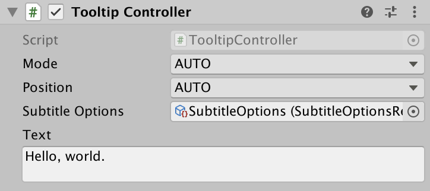

# Tooltips

Tooltips can be added to any game object, without any component dependencies.

### Properties

| Property         | Description                                                          |   Default |
| ---------------- | -------------------------------------------------------------------- | --------: |
| Default Mode     | Mode to render subtitle. Either `SCREEN`, `HEADSET`, or `OBJECT`     | `HEADSET` |
| Default Position | Position subtitles should render on screen. Either `TOP` or `BOTTOM` |  `BOTTOM` |
| Subtitle Options | Reference to a subtitle options asset <a href="#1">1</a>  |    `Null` |
| Text             |                                                                      |      `""` |

<a name="1">1</a>: Create asset via `Assets/A11YTK/Subtitle Options` context menu
