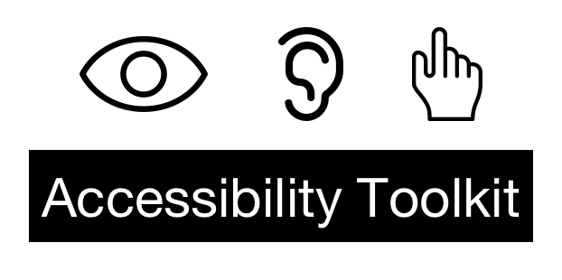
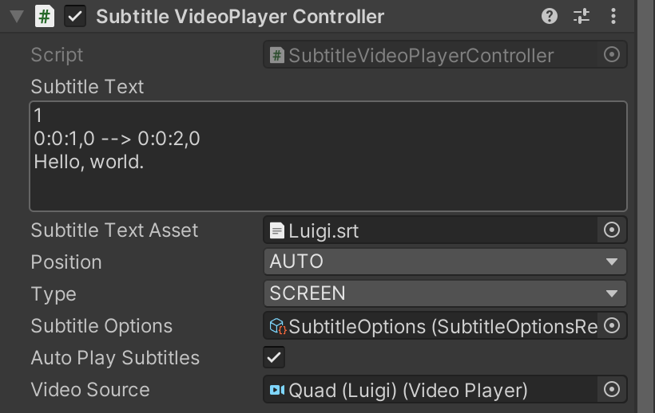
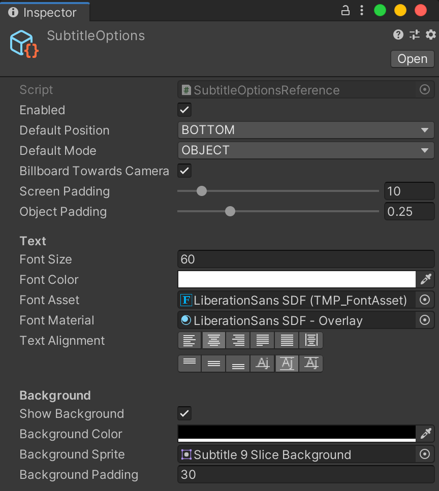

# 

> AR/VR context aware, spatialized subtitles for Unity

## Installation

### Unity Package Manager

<https://docs.unity3d.com/Packages/com.unity.package-manager-ui@2.0/manual/index.html>

#### Git

```json
{
  "dependencies": {
    "com.scottdoxey.a11ytk": "https://github.com/neogeek/a11ytk.git#upm",
    ...
  }
}
```

### Include tests

```json
{
  "dependencies": {
    ...
  },
  "testables": ["com.scottdoxey.a11ytk"]
}
```

Install [TextMeshPro](https://docs.unity3d.com/Manual/com.unity.textmeshpro.html) and then import `Essential Resources` and `Examples and Extras`.

## Quick Start

Attach a `SubtitleAudioSourceController` or `SubtitleVideoPlayerController` component to any GameObject that has an `AudioSource` or `VideoPlayer` component respectively.



Using an SRT file, either paste the contents or drag the asset reference into the `Subtitle Text` or `Subtitle Text Asset` property respectively.

Create a `Subtitle Options` asset via the create asset menu via `A11YTK > Subtitle Options` and populate with the values seen in the screenshot below.



Drag the `Subtitle Options` asset into the `Subtitle Options` property of the `SubtitleAudioSourceController` or `SubtitleVideoPlayerController` component.

## Documentation

### SubtitleOptions

#### Properties

| Property              | Description                                            | Default  |
| --------------------- | ------------------------------------------------------ | -------- |
| Enabled               | Toggle subtitles on or off.                            | `Off`    |
| Default Position      | Position subtitles should render on screen.            | `Bottom` |
| Font Size             | Subtitle font size.                                    | `30`     |
| Font Foreground Color | Subtile font color                                     | `White`  |
| Font Background Color | Background color that appears behind subtitle text     | `Black`  |
| Show Background Color | Toggle subtitle background on or off.                  | `On`     |
| Font Asset            | TextMeshPro font to render subtitle with.              | `Null`   |
| Font Material         | TextMeshPro material to use with the TextMeshPro font. | `Null`   |

#### Methods

##### Save

Save current state of the `SubtitleOptions` asset to file path.

```csharp
using A11YTK;
using UnityEngine;

public class SubtitleOptionManager : MonoBehaviour
{

    private const string SUBTITLE_OPTIONS_FILENAME = "subtitleOptions.dat";

    [SerializeField]
    private SubtitleOptionsReference _subtitleOptions;

    ...

    public void OnDisable()
    {

        _subtitleOptions.Save(SUBTITLE_OPTIONS_FILENAME);

    }

}
```

##### Load

Load saved state from a local file into the `SubtitleOptions` asset.

```csharp
using A11YTK;
using UnityEngine;

public class SubtitleOptionManager : MonoBehaviour
{

    private const string SUBTITLE_OPTIONS_FILENAME = "subtitleOptions.dat";

    [SerializeField]
    private SubtitleOptionsReference _subtitleOptions;

    public void OnEnable()
    {

        _subtitleOptions.Load(SUBTITLE_OPTIONS_FILENAME);

    }

    ...

}
```

##### Delete

Delete local file.

```csharp
_subtitleOptions.Delete("subtitleOptions.dat");
```

## Contributors

### Core Team

|  |  |  |
| ------------------------------------------------------------------------------- | ----------------------------------------------------------------------------------- | --------------------------------------------------------------------------------- |
| [Scott Doxey](https://github.com/neogeek)                                       | [Luigi Cody Nicastro](https://github.com/luiginicastro)                             | [Mo Kakwan](https://github.com/luiwavewashginicastro)                             |

## Contributing

Be sure to review the [Contributing Guidelines](https://github.com/neogeek/A11YTK/blob/master/CONTRIBUTING.md) before logging an issue or making a pull request.

## License

[MIT](https://github.com/neogeek/A11YTK/blob/master/LICENSE)
